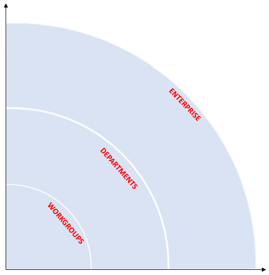
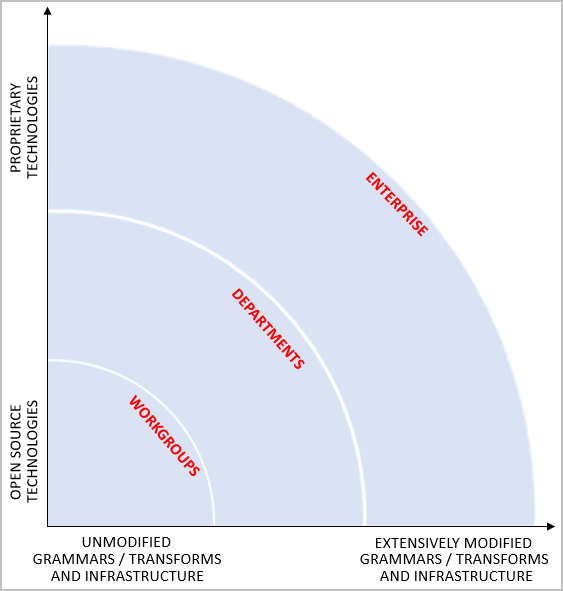
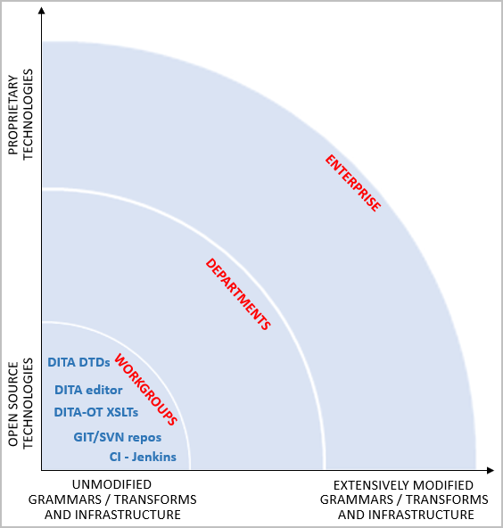
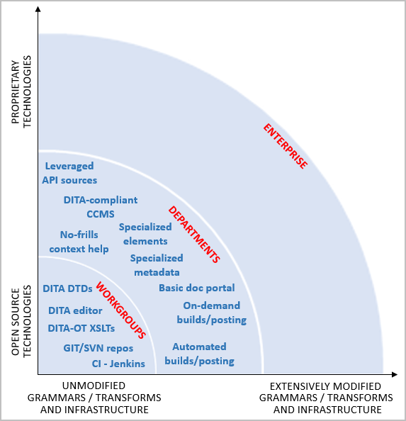
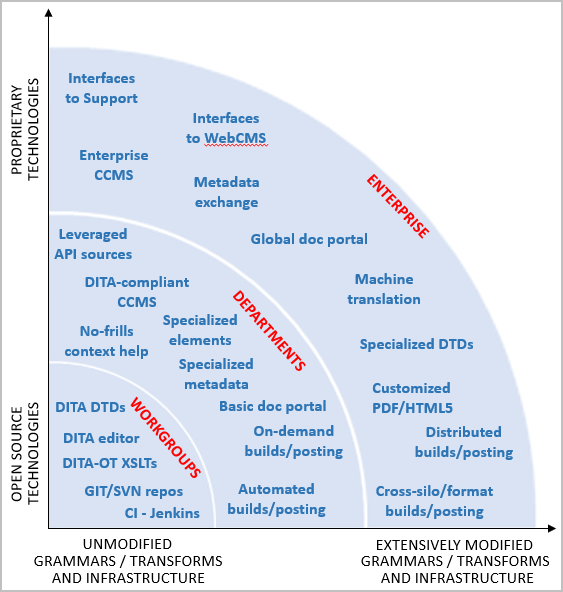
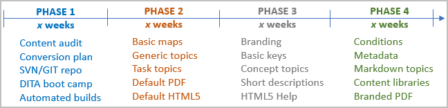
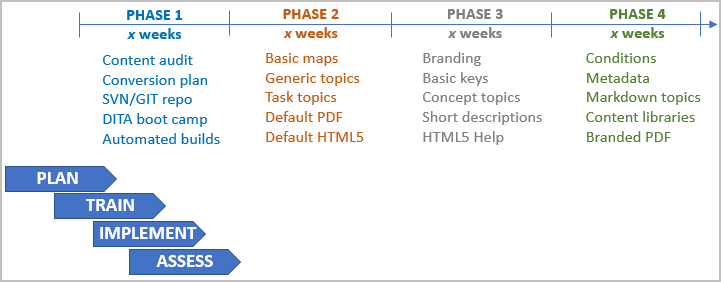
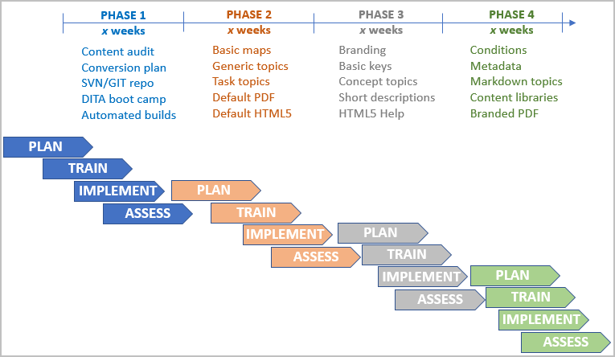

# DITA Migration Best Practices for Workgroups (DRAFT IN PROGRESS)
First pass at collecting best practices for small- to medium-sized teams migrating to OASIS DITA.

This is edit 2 for BDUG.

So - your workgroup or division is considering a migration to DITA, but your management team has not made firm commitments to you about:

* Increased operating budget
* Increased staffing
* Relief from continuous release deadlines

You are tasked with developing a migration proposal in the absence of guarantees that these supporting commitments will be in place. How might *you* approach this task based upon the collective experience of other startups, workgroups, or divisions that have successfully completed a migration?

In short -- be conservative, be realistic, be agile. In OASIS meetings, we often describe DITA simultaneously as "highly beneficial" and "highly disruptive." It's only human nature to focus on the former, all those tantalizing DITA mapping, metadata, processing, reuse, and conditionalization features. What tends to kill DITA migration projects are all the disruptions, all the change management and process re-engineering work that is rarely apparent when you are reading about DITA or doing a preliminary pilot project. The big companies with access to dedicated tool engineers, information architects, conversion budgets, and consultants can recover from mistakes in planning or execution; workgroups without a lot of support cannot.

I like sailing analogies. No sailboat can sail directly into the wind, it must tack to port and starboard periodically to fill its sails and stay on course as best it can. A sailing ship that is "close to the wind" is one that can make good headway into the wind with only minor course deviations, say 10-degree or 20-degree tacks. "Heavy sailers" are ships that need to make more significant course deviations to stay on course, say 30-degree or 40-degree tacks. Big companies moving to DITA can afford to be heavy sailers; they have a huge payoff when they get to port -- even if it takes longer to get there. If a workgroup migration can afford only 15-degree tacks to stay on budget or on schedule and it veers off on a 40-degree tack, the migration is probably over. 

Making mistakes and course corrections during a DITA migration are inevitable. Expect them. The following best practices for workgroup DITA migrations are designed to reduce the amount of time or effort that is required for you to recover, to get back on the right tack. Let's take an example. If your workgroup does not have an experienced DITA architect on board (and most do not), you are going to bump into lots of little surprises and gotchas. No avoiding them. If you have made technology and design choices that maximize the ability of DITA experts and user groups in the community to help you out when you veer off course, your mean recovery time will be short. If many of your "surprises" are familiar issues to people on the DITA support lists or attending local DITA meetings, you'll get the help that you need quickly. If you adopt highly proprietary technologies or highly customized designs too early in your voyage, you will have limited the ability of people outside your workgroup to help you get back on course. Heavy sailing. 

The following best practices focus on workgroup-class migrations. They are input to your migration planning process. Adapt and season to taste.

## Align your DITA migration goals to organizational realities

there is no one-size-fits-all migration process. The business needs and content development requirements of a 10-person startup differ significantly than those of a 50-person department or 500-person enterprise team.  

Unlike commercial content development environments, DITA is an industry standard developed and supported by OASIS the Organization for the Advancement of Structured Information Systems. Basing your content development process on a standard versus a proprietary tool brings with it a different perspective on managing your publishing technology. 

* *X-axis - Adherence to the base DITA grammars and DITA-OT transformations*: DITA was designed to be extended through a process called specialization. If you have the know-how as a Department or Enterprise organization and you have a business need, you can constrain or extend the out-of-the-box DITA grammar files (DTDs and element vocabulary modules) to meet most any new requirement coming your way. This flexibility future-proofs your investment. Similarly, the out-of-the-box DITA-OT transforms for PDF, HTML5, or other output formats are customizable. The ability of DITA to scale in tandem with the evolution of your organizational requirements is a big deal. 

* *Y-axis - Adoption of open-source and proprietary technology*: OASIS DITA, the DITA Open Toolkit, and many DITA-related technologies are open source technologies. Being open source does not guarantee that something is usable or of high quality, but it does impose an expectation that any commercial tool claiming to be compliant with these open source standards does, in fact, supplement and enhance the open source standard rather than replacing open source elements with proprietary ones. 

While workgroup-class organizations come up to speed on DITA and determine how much they need to customize the out-of-the-box DTDs, grammars, and DITA-OT transformations, hey should consider basing their pilots and initial production implementations on default (out-of-the-box) resources for grammars, vocabularies, processing, and build technologies. Relying upon commercial tools that preserve and extend the standard is inevitable. DITA-compliant editors are a great example. You can't expect professional writers to be working in dopey open source editors when there are several DITA- compliant editors available reasonable cost. Choosing content management or other processing technologies that are not DITA-compliant may be necessary, but only in the context of having exhausted every DITA-compliant option. 

DITA is prone to the fallacy of manifest destiny, the notion that some small movement toward DITA migration necessarily involves a complete migration toward all DITA features, regardless of their relevance to business need. In American mythology, Lewis and Clark conquered all obstacles without the assistance of First Nation peoples in their migration from Virginia to California. 

Workgroup organizations attempting to specialize DITA without adequate support will not make it across the prairies or Rocky Mountains. "DITA maturity" needs to be redefined in terms of decision making, specifically deciding what is "good enough" for workgroup, department, and enterprise organizations.

Department-level DITA implementations need to take advantage of the customization options available in DITA and the DITA Open Toolkit *after* they have determined that default, out-of-the-box solutions will not satisfy their business requirements.  

At the enterprise level, the shortcomings of DITA as an enterprise-class solution need to supplemented with standards-aware solutions.  

| Org (# writers) | DITA expertise | Customizations | Content MGT | Sharing |
| ------------ | ------- | -------------------- | ---- | ---------- |
|Workgroup (2-10) |Informal training No DITA IA No DITA toolsmith |Almost none Unmodified OASIS DTDs Minimally modified DITA-OT transforms Unmodified filtering conditions|SVN or GIT Filesystem |None| 
|Department (11-50) |Formal training 2+ DITA IAs 1+ DITA toolsmiths |Some specialized DTDs Some constraints Some custom metadata Extensive transform work Some shared filtering conditions |SVN or GIT DITA-compliant CCMS?|Some share topics Some shared library elements Some shared data with engineering | 
|Enterprise %1+ |3+ dedicated IAs 10+ dedicated toolsmiths |Extensive shared metadata Extensive sharede context|DITA-compliant CCMS Non-compliant DITA CCMS| Specialized grammars Customized DITA-OT transforms |Extensive shared content |
 

## Align your DITA migration goals to management priorities

Customers do not care how we author content. They want accurate, complete technical content delivered to them as they use our products to solve business problems. Our management organizations *do* care how efficiently we author, curate, build, translate, and distribute product content. DITA was designed to address some of the major causes of inefficiency in book-oriented content development:

1. *Low content reuse within and across organizations*: Results in costly re-implementation, re-testing, and global inaccuracy. 
1. *Poor separation of content from formatting*: Results in lower writer productivity and reduced ability to reuse content between output formats.
1. *Poor separation of content from context*: Results in duplicating similar content many times to satisfy minor variations in context (links, product names, platforms). 
1. *Low source consistency*: When the authoring environment imposes no restrictions, consistent is entirely discretionary.
1. *Low output consistency*: When individual source files contain style overrides or local formatting, the generated output can vary significantly.
1. *Inconsistent information architecture*: When the authoring environment does not require that similar types of information be structured similarly, any type of product content might be mixed with any other. 
1. *Impoverished metadata and semantic markup*: When the authoring environment does not encourage content developers to tag content for semantic meaning or to add descriptive metadata, downstream systems (SEO) and systems (bots) have a more difficult time leveraging information. 
1. *Opaque content management*: When the authoring environment cannot determine where content lives and how many dependencies there are between pieces of content, the content is really controlling the team -- not the team controlling its content. 
1. *Poor content collaboration with engineering*: When the authoring environment does not support engineering-friendly formats such as Markdown, ReStructuredText, or even MS Word, the ability of engineering peers to contribute significantly to content development is low. 

The DITA standard and its supporting tools can help with all of these issues, but *it takes time*. If a workgroup attempts simultaneously to learn DITA, convert its content to DITA, implement DITA tooling, standardize its markup, customize its outputs, and achieve significant reuse, it will almost certainly fail. 

If the two highest pain points for management are lack of content/formatting separation and source inconsistency, just converting your current sources into DITA and running them through some company-branded version of the DITA Open Toolkit transforms will help tremendously. Make those goals #1 and #2 for the first year. Reuse, metadata, and consistent IA become issues for subsequent years or phases. 

If management primarily wants to see increased collaboration between writing, engineering, support, and marketing professionals, you want to move you existing content to XML DITA while ramping up Lightweight DITA extensions for Markdown and HTML5. Content management and output consistency become candidates for subsequent years or phases. 

Set expectations with *everyone*. Be ruthless in deferring nice-to-have enhancements. 

## Develop a 360-degree communications plan

No brainer. Formally structure communications, meetings, and status readouts with:

* Management
* Individual contributors (writers) 
* Vendors
* Company stakeholders (Support, Marketing, UXD, Sales)

# Adopt technologies and designs that maximize the ability of people outside your workgroup to help you

* Industry standards (DITA)
* Standards-compliant commercial software (DITA editors) 
* Open source software (DITA Open Toolkit)
* Common engineering infrastructure software (Git, SVN, Jenkins)

## Make the migration a budgeted project

DITA migrations are neither magic nor free. Enlist the assistance of your program management team to structure the migration as a real project. 

**TIP**: If management does not approve the incremental expenses or downtime, do not start the migration. 

## Build multiple phases into your plan

Set your goals. 

## Commit to support your staff

Invest in the people dimension. Leave no writer behind. 

